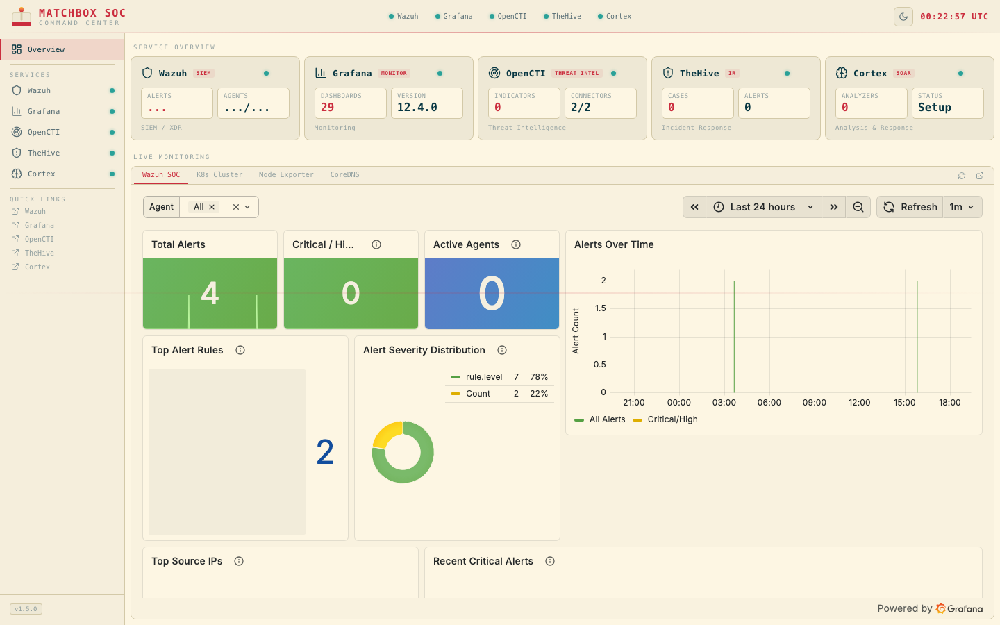

# MatchBox


A professional-grade home SOC (Security Operations Center) running on lightweight Kubernetes, designed for the Mac Mini M4 (16GB RAM).

## What's Inside

| Component | Role | Why |
|-----------|------|-----|
| **Wazuh 4.14.3** | SIEM/XDR | Log collection, threat detection, file integrity monitoring, vulnerability scanning |
| **OpenCTI 6.9.5** | Threat Intelligence | MITRE ATT&CK mapping, IOC management, threat feed aggregation |
| **TheHive + Cortex** | Incident Response | Case management, automated analysis (VirusTotal, AbuseIPDB, etc.) |
| **Grafana** | Monitoring | SOC dashboards, cluster health, compliance visualization |
| **k3s** | Kubernetes | Lightweight orchestration for all components |
| **MCP Servers** | AI Integration | Claude Code can query alerts, cases, and threat intel directly |

## Quick Start

### Prerequisites
- macOS with Apple Silicon (M1/M2/M3/M4)
- Homebrew installed
- 16GB+ RAM (32GB recommended)
- 120GB+ free disk space

### 1. Install Dependencies
```bash
brew install lima kubectl helm
```

### 2. Start the Cluster
```bash
cd MatchBox
./scripts/setup-lima.sh
```

### 3. Deploy the Stack
```bash
./scripts/deploy-stack.sh
```

### 4. Access Dashboards
Add to `/etc/hosts`:
```
<lima-vm-ip>  soc.homelab.local
```

Then open:
- Wazuh: https://soc.homelab.local/wazuh
- TheHive: https://soc.homelab.local/thehive
- OpenCTI: https://soc.homelab.local/opencti
- Grafana: https://soc.homelab.local/grafana

### 5. Test the Pipeline
```bash
./scripts/test-flow.sh
```

## Resource Profile (Slim Config)

Designed for 16GB Mac Mini M4. Lima VM gets 10GB RAM.

| State | RAM Usage | What's Running |
|-------|-----------|----------------|
| Steady state | ~7.1GB | k3s, OpenSearch, Wazuh, Monitoring (always-on) |
| Investigation mode | ~10.5GB | + TheHive, Cortex, OpenCTI (on-demand) |
| Full stack | ~10.5GB | Everything, connectors scheduled via CronJobs |

## MCP Server Integration

Three custom MCP servers let Claude Code interact with the SOC:

```bash
# Query Wazuh alerts from Claude Code
"Show me all critical alerts from the last 24 hours"

# Manage TheHive cases
"Create a case for the brute force attack on 192.168.1.50"

# Search OpenCTI threat intel
"What MITRE ATT&CK techniques are associated with this IP?"
```

## Dashboard



The **MatchBox SOC Command Center** is a SvelteKit dashboard that unifies all 5 services into a single pane of glass with live monitoring.

### Running the Dashboard

```bash
# 1. Copy environment config
cp .env.example .env
# Edit .env with your service credentials

# 2. Port-forward Grafana (from your k3s cluster)
kubectl port-forward -n monitoring svc/monitoring-grafana 3000:80 &

# 3. Start the dashboard
cd dashboard
npm install
npm run dev -- --port 5173

# 4. Open http://localhost:5173
```

### What You Get
- **Service Overview** — Health status and key metrics for Wazuh, Grafana, OpenCTI, TheHive, and Cortex
- **Live Monitoring** — Embedded Grafana dashboards (Wazuh SOC, K8s Cluster, Node Exporter, CoreDNS) with theme sync
- **Wazuh Detail** — Alert breakdown, agent status, CIS Benchmark SCA compliance with segmented progress bars
- **Per-Service Pages** — Deep-dive views for each tool with real-time metrics
- **Solarized Theme** — Light/Dark toggle that syncs across the dashboard and embedded Grafana

## Documentation
- [Architecture Design](docs/architecture.md)
- [Network Diagram](docs/network-diagram.md)
- [Resource Requirements](docs/resource-requirements.md)
- [Integration Details](docs/integrations.md)
- [MCP Server Design](docs/mcp-servers.md)
- [Runbook: Initial Setup](docs/runbooks/initial-setup.md)
- [Runbook: Adding Agents](docs/runbooks/adding-agents.md)
- [Runbook: Incident Response](docs/runbooks/incident-response.md)
