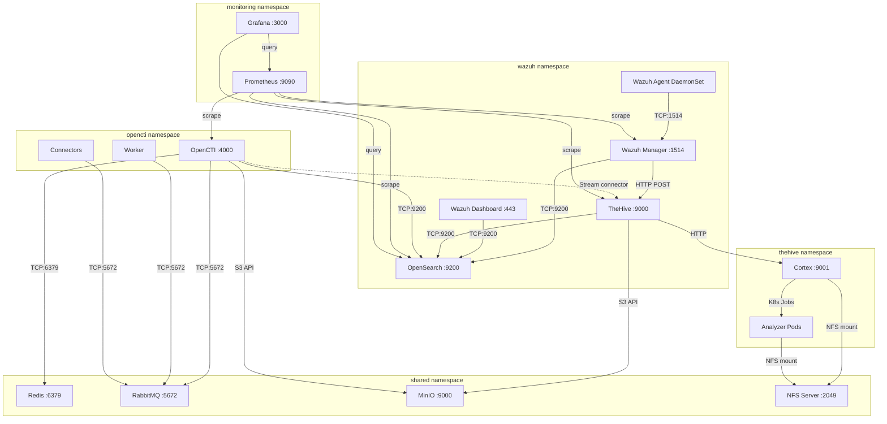

# Network Diagram

## Port Map

### External Access (via Traefik Ingress)
```
Browser/Client
      |
      | HTTPS (443)
      v
  Traefik Ingress Controller
      |
      +-- /wazuh   --> wazuh-dashboard:443    (wazuh namespace)
      +-- /thehive  --> thehive:9000           (thehive namespace)
      +-- /cortex   --> cortex:9001            (thehive namespace)
      +-- /opencti  --> opencti:4000           (opencti namespace)
      +-- /grafana  --> grafana:3000           (monitoring namespace)
```

### Internal Service Communication


## Port Reference

| Port | Protocol | Service | Direction | Notes |
|------|----------|---------|-----------|-------|
| 443 | HTTPS | Traefik Ingress | External | All web UIs |
| 6443 | HTTPS | k3s API Server | Host only | kubectl access |
| 1514 | TCP | Wazuh Agent | Internal/NodePort | Agent-to-Manager syslog |
| 1515 | TCP | Wazuh Registration | Internal/NodePort | Agent enrollment |
| 9200 | TCP | OpenSearch | Internal | REST API |
| 9300 | TCP | OpenSearch | Internal | Node-to-node transport |
| 9000 | TCP | TheHive / MinIO | Internal | Shared port, different namespaces |
| 9001 | TCP | Cortex | Internal | REST API |
| 4000 | TCP | OpenCTI | Internal | Web + GraphQL API |
| 6379 | TCP | Redis | Internal | OpenCTI cache/streaming |
| 5672 | TCP | RabbitMQ | Internal | OpenCTI message queue |
| 15672 | TCP | RabbitMQ Management | Internal | Admin UI (optional) |
| 3000 | TCP | Grafana | Internal | Dashboard UI |
| 9090 | TCP | Prometheus | Internal | Metrics API |
| 2049 | TCP/UDP | NFS | Internal | Cortex shared filesystem |

## Lima VM Port Forwarding

These ports are forwarded from the Mac Mini host to the Lima VM:

```yaml
portForwards:
  - guestPort: 6443    # k3s API
    hostPort: 6443
  - guestPort: 80      # HTTP ingress
    hostPort: 80
  - guestPort: 443     # HTTPS ingress
    hostPort: 443
  - guestPort: 1514    # Wazuh agent (if monitoring external hosts)
    hostPort: 1514
  - guestPort: 1515    # Wazuh registration
    hostPort: 1515
```

## DNS Configuration

Add to `/etc/hosts` on the Mac Mini:
```
127.0.0.1  soc.homelab.local
```

Lima VM port forwarding maps host ports directly, so `127.0.0.1` works.

## Firewall Considerations

For a home lab, the Mac Mini firewall should:
- Allow inbound on 1514/1515 if monitoring other devices on the LAN
- Block external access to 6443 (k3s API) — management only from localhost
- All web UIs behind Traefik with BasicAuth — no direct pod exposure
